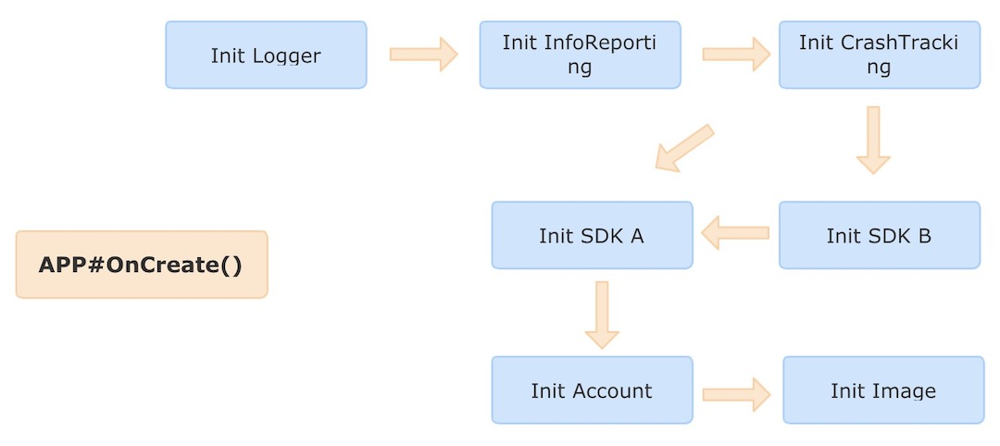
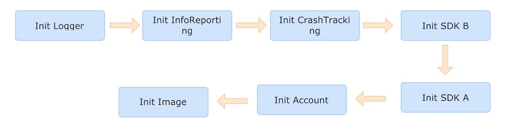

## Star Driver

A library for managing the initialization tasks when an android application startup. It provides a simple way to control the order of tasks.

## Version

- APT/Android Annotation Processor

    https://github.com/succlz123/StarDriver-APT

- Gradle Transform

    https://github.com/succlz123/StarDriver-Transform

## Work Flow

> The Tasks that need to be initialized in the application.

> Automatically sort is based on before and after dependencies.

## Usage

### Build.gradle

~~~
dependencies {
    classpath 'com.android.tools.build:gradle:3.6.3'
    classpath 'org.succlz123.stardriver:stardriver-plugin:0.0.1'
}
~~~

~~~
apply plugin: 'org.succlz123.stardriver'
~~~

~~~
implementation project(path: ':stardriver-annotation')
implementation project(path: ':stardriver-lib')
~~~

### Init Task

~~~java
public class AppInitLogger extends IStarDriver {

    @Override
    public void initialize(Context context, StarDriverResult result) {
        try {
          	// simulation initialization code
            Thread.sleep(23);
        } catch (InterruptedException e) {
            result.success = false;
            result.errorMessage = e.toString();
            return;
        }
        result.success = true;
    }
}
~~~

### Setting task priorities

~~~java
@StarDriverInit(name = "Account Info")
public class AppInitAccountInfo extends IStarDriver {

    @Override
    public void initialize(Context context, StarDriverResult result) {
        try {
            Thread.sleep(10);
        } catch (InterruptedException e) {
            result.success = false;
            result.errorMessage = e.toString();
            return;
        }
        result.success = true;
    }
}
~~~

### Application

~~~java
public class MainApplication extends Application {

    @Override
    public void onCreate() {
        super.onCreate();
        methodA();
        StarDriverManager starDriverManager = new StarDriverManager();
        starDriverManager.initTasks(this);
        // The statistics contain the task name and time-taken.
        List<StarDriverStatistics> statistics = starDriverManager.getStatistics();
        methodB();
    }
}
~~~
